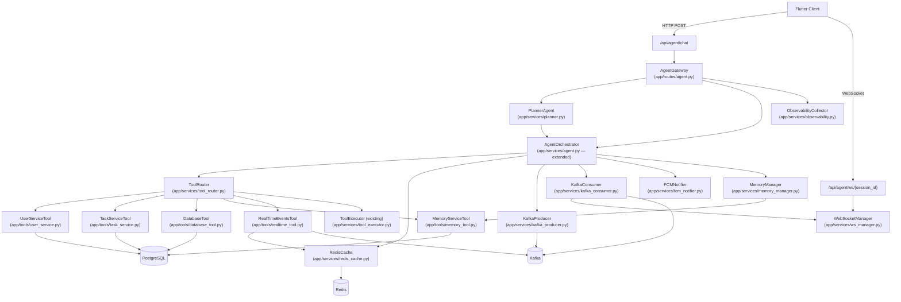

# Design Document — Full-Stack Agent Orchestration

## Overview

This design extends the existing FastAPI chatapp backend into a production-grade agent platform. The existing components — `ToolRegistry`, `ToolExecutor`, `DecisionEngine`, `TokenBudgetManager`, `CitationTracker`, and the multi-provider `FallbackRouter` — remain unchanged. New components are layered on top.

The end-to-end request path is:

1. **Agent_Gateway** (`/api/agent/chat` or `/api/agent/ws/{session_id}`) receives a user request.
2. **Planner_Agent** decides if the request is multi-step. If yes, it produces an `Execution_Plan`.
3. **Tool_Router** classifies and dispatches each `ToolCall` to the correct tool: `User_Service_Tool`, `Task_Service_Tool`, `Database_Tool`, `Memory_Service_Tool`, `Real_Time_Events_Tool`, or the existing `ToolExecutor` (external tools).
4. The **Agent_Orchestrator** (extended `agent.py`) orchestrates the reasoning loop, consuming Redis for session state, Kafka for event streaming, and pgvector for memory context.
5. Responses are streamed via **WebSocket_Manager** (or SSE fallback). FCM push notifications are sent when no WebSocket session is active.

The LLM never receives database connections, credentials, or infrastructure handles. Every system interaction goes through a registered `ToolCall`.


---

## Architecture

### Component Diagram



### HTTP Request Data Flow

```
Client → POST /api/agent/chat
  → AgentGateway: validate schema, attach Correlation_ID, check auth + rate limit
  → PlannerAgent: classify simple vs. multi-step
    → [multi-step] produce Execution_Plan, publish plan_created Kafka event
    → [simple] pass through
  → AgentOrchestrator:
      → MemoryManager.auto_search() → prepend ## Relevant Memory
      → KafkaProducer.publish(request_received)
      → RedisCache.get(session:{session_id})
      → [for each subtask / single step]:
          → DecisionEngine.decide()
          → ToolRouter.route() → dispatch to tool
          → KafkaProducer.publish(tool_started / tool_completed / tool_failed)
      → FallbackRouter.route_chat() → LLM response
      → MemoryManager.auto_store(user_msg, assistant_msg)
      → RedisCache.set(session:{session_id})
      → KafkaProducer.publish(response_generated)
  → AgentGateway: return ChatResponse with X-Correlation-ID header
```

### WebSocket Data Flow

```
Client → WS connect /api/agent/ws/{session_id}
  → AgentGateway: validate session token → WebSocketManager.register(session_id, ws)
  → Client sends JSON: {"type": "chat", "message": "...", "conversation_id": ...}
  → AgentGateway: route to AgentOrchestrator (streaming)
  → Tokens streamed → WebSocketManager.send(session_id, {"type": "token", "content": "..."})
  → WebSocketManager.send(session_id, {"type": "done", ...})
  → [background] KafkaConsumer receives notify_user → WebSocketManager.send()
```


---

## New File / Module Structure

Every new file is additive. No existing file is deleted or replaced (only `app/main.py`, `app/config.py`, `app/models/db_models.py`, and `app/models/schemas.py` receive additive edits).

```
app/
  config.py                         ← additive: new Settings fields
  main.py                           ← additive: include agent router, lifespan hooks
  models/
    db_models.py                    ← additive: User, Task, MemoryChunk, FCMToken, AuditLog
    schemas.py                      ← additive: AgentChatRequest, AgentChatResponse, etc.
  routes/
    agent.py                        ← NEW: /api/agent/* HTTP + WebSocket endpoints
  services/
    ws_manager.py                   ← NEW: WebSocketManager
    planner.py                      ← NEW: PlannerAgent
    tool_router.py                  ← NEW: ToolRouter
    redis_cache.py                  ← NEW: RedisCache
    kafka_producer.py               ← NEW: KafkaProducer
    kafka_consumer.py               ← NEW: KafkaConsumer (background task)
    fcm_notifier.py                 ← NEW: FCMNotifier
    memory_manager.py               ← NEW: MemoryManager (auto-store / auto-search)
    observability.py                ← NEW: ObservabilityCollector, Prometheus counters
    feature_flags.py                ← NEW: AgentFeatures (parsed from AGENT_FEATURES)
  tools/
    user_service.py                 ← NEW: user_get, user_list, user_create, user_update
    task_service.py                 ← NEW: task_get, task_list, task_create, task_update, task_complete
    database_tool.py                ← NEW: query_database
    memory_tool.py                  ← NEW: memory_store, memory_search, memory_delete, memory_store_batch
    realtime_tool.py                ← NEW: realtime_get_state, realtime_recent_events
    __init__.py                     ← additive: import new tool modules
migrations/
  versions/
    001_add_agent_tables.py         ← NEW: Alembic migration for new tables
```


---

## Components and Interfaces

### 1. Feature Flags — `app/services/feature_flags.py`

```python
from dataclasses import dataclass, field
from functools import lru_cache
import os

@dataclass(frozen=True)
class AgentFeatures:
    planner: bool
    redis_cache: bool
    kafka: bool
    fcm: bool
    websocket: bool

@lru_cache(maxsize=1)
def get_agent_features() -> AgentFeatures:
    raw = os.environ.get("AGENT_FEATURES", "")
    enabled = {f.strip().lower() for f in raw.split(",") if f.strip()}
    return AgentFeatures(
        planner="planner" in enabled,
        redis_cache="redis_cache" in enabled,
        kafka="kafka" in enabled,
        fcm="fcm" in enabled,
        websocket="websocket" in enabled,
    )
```

All new services check `get_agent_features()` before initializing. When a flag is absent the service degrades gracefully to the equivalent existing behavior.

---

### 2. WebSocket Manager — `app/services/ws_manager.py`

```python
import asyncio
import logging
from fastapi import WebSocket
from typing import Optional

logger = logging.getLogger(__name__)

class WebSocketManager:
    """Manages up to 100 concurrent WebSocket sessions.

    Key behaviours:
    - register / unregister are atomic (single dict mutation under asyncio event loop).
    - send() is fire-and-forget; errors close the session.
    - Keepalive loop sends ping every 30 min; removes session if no pong in 10 s.
    """

    MAX_SESSIONS: int = 100
    IDLE_TIMEOUT_S: float = 1800.0    # 30 minutes
    PING_WAIT_S: float = 10.0

    def __init__(self) -> None:
        self._sessions: dict[str, WebSocket] = {}
        self._last_activity: dict[str, float] = {}
        self._keepalive_task: Optional[asyncio.Task] = None

    async def start(self) -> None:
        """Start keepalive background loop. Call from FastAPI lifespan."""
        self._keepalive_task = asyncio.create_task(self._keepalive_loop())

    async def stop(self) -> None:
        if self._keepalive_task:
            self._keepalive_task.cancel()

    def count(self) -> int:
        return len(self._sessions)

    async def register(self, session_id: str, ws: WebSocket) -> None:
        """Register a WebSocket; raises RuntimeError if at capacity."""
        if len(self._sessions) >= self.MAX_SESSIONS:
            raise RuntimeError("WebSocket session limit reached")
        self._sessions[session_id] = ws
        self._last_activity[session_id] = asyncio.get_event_loop().time()
        logger.info(f"[WS] Registered session {session_id} ({len(self._sessions)} active)")

    async def unregister(self, session_id: str) -> None:
        """Atomically remove session and release resources."""
        self._sessions.pop(session_id, None)
        self._last_activity.pop(session_id, None)
        logger.info(f"[WS] Unregistered session {session_id}")

    def is_active(self, session_id: str) -> bool:
        return session_id in self._sessions

    async def send(self, session_id: str, payload: dict) -> None:
        """Send JSON payload; closes session on send error."""
        ws = self._sessions.get(session_id)
        if ws is None:
            return
        try:
            await ws.send_json(payload)
            self._last_activity[session_id] = asyncio.get_event_loop().time()
        except Exception as exc:
            logger.warning(f"[WS] Send failed for {session_id}: {exc}. Closing.")
            await self.unregister(session_id)
            try:
                await ws.close()
            except Exception:
                pass

    async def send_error_and_close(self, session_id: str, message: str) -> None:
        ws = self._sessions.get(session_id)
        if ws is None:
            return
        try:
            await ws.send_json({"type": "error", "message": message})
        except Exception:
            pass
        await self.unregister(session_id)
        try:
            await ws.close()
        except Exception:
            pass

    async def _keepalive_loop(self) -> None:
        import time
        while True:
            await asyncio.sleep(60)
            now = asyncio.get_event_loop().time()
            stale = [sid for sid, t in self._last_activity.items()
                     if now - t > self.IDLE_TIMEOUT_S]
            for sid in stale:
                await self._ping_or_close(sid)

    async def _ping_or_close(self, session_id: str) -> None:
        ws = self._sessions.get(session_id)
        if ws is None:
            return
        try:
            await ws.send_json({"type": "ping"})
            await asyncio.wait_for(ws.receive_text(), timeout=self.PING_WAIT_S)
            self._last_activity[session_id] = asyncio.get_event_loop().time()
        except Exception:
            logger.info(f"[WS] Ping timeout for {session_id}, closing.")
            await self.unregister(session_id)
            try:
                await ws.close()
            except Exception:
                pass

# Module-level singleton
ws_manager = WebSocketManager()
```


---

### 3. Tool Router — `app/services/tool_router.py`

```python
import logging
from dataclasses import dataclass
from typing import Literal
from .tool_registry import ToolRegistry
from .tool_models import ToolCall, ToolResult

logger = logging.getLogger(__name__)

ToolCategory = Literal["service_tool", "database_tool", "memory_tool", "realtime_tool", "external_tool"]

_PREFIX_MAP: dict[str, ToolCategory] = {
    "user_":     "service_tool",
    "task_":     "service_tool",
    "query_":    "database_tool",
    "memory_":   "memory_tool",
    "realtime_": "realtime_tool",
}

def classify_tool(name: str) -> ToolCategory:
    """Pure prefix-based classification. Never consults the registry."""
    for prefix, category in _PREFIX_MAP.items():
        if name.startswith(prefix):
            return category
    return "external_tool"

class ToolRouter:
    """Classifies Tool_Calls and dispatches them to the correct handler.

    Handlers are injected at construction time so they can be mocked in tests.
    """

    def __init__(
        self,
        registry: ToolRegistry,
        user_service,        # UserServiceTool instance
        task_service,        # TaskServiceTool instance
        database_tool,       # DatabaseTool instance
        memory_tool,         # MemoryServiceTool instance
        realtime_tool,       # RealTimeEventsTool instance
        tool_executor,       # existing ToolExecutor
    ) -> None:
        self.registry = registry
        self._handlers = {
            "service_tool":  self._dispatch_service,
            "database_tool": database_tool.execute,
            "memory_tool":   memory_tool.execute,
            "realtime_tool": realtime_tool.execute,
            "external_tool": tool_executor.execute_batch,
        }
        self._user_service = user_service
        self._task_service = task_service

    async def route(self, call: ToolCall, correlation_id: str) -> ToolResult:
        """Classify, validate registry presence, dispatch, and log."""
        category = classify_tool(call.tool_name)

        # Validate presence in registry (deferred error per req 4.8)
        tool_def = self.registry.get(call.tool_name)
        if tool_def is None:
            logger.info(
                f"[ToolRouter] tool={call.tool_name} category={category} "
                f"target=N/A correlation_id={correlation_id} NOT_FOUND"
            )
            return ToolResult(
                call_id=call.call_id,
                tool_name=call.tool_name,
                status="error",
                data=None,
                error_message=f"Tool '{call.tool_name}' not found in registry",
                execution_time_ms=0.0,
            )

        # Validate tool is enabled (req 19.5)
        if not tool_def.enabled:
            return ToolResult(
                call_id=call.call_id,
                tool_name=call.tool_name,
                status="error",
                data=None,
                error_message=f"Tool '{call.tool_name}' is disabled",
                execution_time_ms=0.0,
            )

        handler_name = self._get_handler_name(category, call.tool_name)
        logger.info(
            f"[ToolRouter] tool={call.tool_name} category={category} "
            f"target={handler_name} correlation_id={correlation_id}"
        )
        return await self._handlers[category](call)

    async def _dispatch_service(self, call: ToolCall) -> ToolResult:
        if call.tool_name.startswith("user_"):
            return await self._user_service.execute(call)
        return await self._task_service.execute(call)

    def _get_handler_name(self, category: ToolCategory, tool_name: str) -> str:
        if category == "service_tool":
            return "UserServiceTool" if tool_name.startswith("user_") else "TaskServiceTool"
        return {
            "database_tool": "DatabaseTool",
            "memory_tool":   "MemoryServiceTool",
            "realtime_tool": "RealTimeEventsTool",
            "external_tool": "ToolExecutor",
        }[category]
```


---

### 4. Planner Agent — `app/services/planner.py`

```python
import json, logging, re
from dataclasses import dataclass, field
from typing import Optional
from sqlalchemy.orm import Session
from .fallback_router import route_chat
from ..models.schemas import MessageDto
from .tool_registry import ToolRegistry

logger = logging.getLogger(__name__)

MAX_SUBTASKS = 10

@dataclass
class Subtask:
    index: int                        # 1-based, unique
    description: str
    required_tools: list[str]
    dependency_indices: list[int]     # all < self.index
    success_criterion: str
    status: str = "pending"           # pending | completed | skipped | failed
    output: Optional[dict] = None
    failure_reason: Optional[str] = None

@dataclass
class ExecutionPlan:
    subtasks: list[Subtask]
    correlation_id: str

class PlannerAgent:
    """Decomposes multi-step requests into an ExecutionPlan.

    Validation and re-planning logic:
    - classify(): asks LLM if request is multi-step
    - plan(): produces ExecutionPlan and validates indices + dependencies
    - Re-plans up to max_retries (default 2) on validation failure
    - Falls back to single-step on exhaustion
    """

    def __init__(
        self,
        registry: ToolRegistry,
        max_retries: int = 2,
    ) -> None:
        self.registry = registry
        self.max_retries = max_retries

    async def classify_and_plan(
        self,
        db: Session,
        user_message: str,
        correlation_id: str,
    ) -> Optional[ExecutionPlan]:
        """Return an ExecutionPlan for multi-step requests, None for simple ones."""
        if not await self._is_multi_step(db, user_message):
            return None

        for attempt in range(self.max_retries + 1):
            plan = await self._generate_plan(db, user_message, correlation_id)
            errors = self._validate_plan(plan)
            if not errors:
                return plan
            logger.warning(
                f"[Planner] Plan validation failed (attempt {attempt+1}): {errors}"
            )

        # Exhausted retries — fall back to single-step
        logger.warning("[Planner] Falling back to single-step execution after retry exhaustion")
        return None

    async def _is_multi_step(self, db: Session, message: str) -> bool:
        prompt = (
            "Determine if this request requires multiple distinct sequential steps "
            "where the output of one step feeds into the next.\n"
            f"Request: {message}\n"
            'Respond with {"multi_step": true} or {"multi_step": false} only.'
        )
        result = await route_chat(
            db=db,
            messages=[MessageDto(role="user", content=prompt)],
            temperature=0.0,
            max_tokens=50,
        )
        try:
            parsed = json.loads(result.content)
            return bool(parsed.get("multi_step", False))
        except Exception:
            return False

    async def _generate_plan(
        self, db: Session, message: str, correlation_id: str
    ) -> ExecutionPlan:
        available_tools = [t.name for t in self.registry.get_enabled()]
        prompt = self._build_planning_prompt(message, available_tools)
        result = await route_chat(
            db=db,
            messages=[MessageDto(role="user", content=prompt)],
            temperature=0.2,
            max_tokens=2048,
        )
        raw = self._parse_json_response(result.content)
        subtasks_raw = raw.get("subtasks", [])[:MAX_SUBTASKS]
        if len(raw.get("subtasks", [])) > MAX_SUBTASKS:
            logger.warning(f"[Planner] Plan had >{MAX_SUBTASKS} subtasks; truncated to {MAX_SUBTASKS}")
        subtasks = [
            Subtask(
                index=s.get("index", i + 1),
                description=s.get("description", ""),
                required_tools=s.get("required_tools", []),
                dependency_indices=s.get("dependency_indices", []),
                success_criterion=s.get("success_criterion", ""),
            )
            for i, s in enumerate(subtasks_raw)
        ]
        return ExecutionPlan(subtasks=subtasks, correlation_id=correlation_id)

    def _validate_plan(self, plan: ExecutionPlan) -> list[str]:
        errors: list[str] = []
        indices = [s.index for s in plan.subtasks]
        n = len(indices)
        if sorted(indices) != list(range(1, n + 1)):
            errors.append(f"Subtask indices {indices} are not unique consecutive integers starting at 1")
        for s in plan.subtasks:
            for dep in s.dependency_indices:
                if dep >= s.index:
                    errors.append(f"Subtask {s.index} has forward dependency on {dep}")
        return errors

    def _build_planning_prompt(self, message: str, tools: list[str]) -> str:
        tools_list = "\n".join(f"- {t}" for t in tools)
        return (
            "Decompose the following request into sequential subtasks.\n"
            f"Available tools:\n{tools_list}\n\n"
            f"Request: {message}\n\n"
            "Respond with JSON matching this schema exactly:\n"
            '{"subtasks": [{"index": 1, "description": "...", '
            '"required_tools": ["tool_name"], "dependency_indices": [], '
            '"success_criterion": "..."}]}'
        )

    @staticmethod
    def _parse_json_response(text: str) -> dict:
        match = re.search(r"```(?:json)?\s*(.*?)```", text, re.DOTALL)
        if match:
            text = match.group(1)
        try:
            return json.loads(text)
        except Exception:
            return {"subtasks": []}
```


---

### 5. Redis Cache — `app/services/redis_cache.py`

```python
import asyncio, json, logging
from typing import Any, Optional
import redis.asyncio as aioredis
from ..config import get_settings

logger = logging.getLogger(__name__)

OPERATION_TIMEOUT_S = 0.5
SESSION_TTL  = 1800   # 30 min
USER_TTL     = 300    # 5 min
TOOLS_TTL    = 60     # 1 min

class RedisCache:
    """Async Redis wrapper with connection pooling and 500 ms operation timeout.

    All public methods catch exceptions and return None/False on failure so
    callers can treat them as cache misses without special error handling.
    Pool: min_size=5, max_size=20.
    """

    def __init__(self, url: str) -> None:
        self._pool = aioredis.ConnectionPool.from_url(
            url,
            min_connections=5,
            max_connections=20,
            decode_responses=True,
        )
        self._client = aioredis.Redis(connection_pool=self._pool)

    async def ping(self) -> bool:
        """Health check. Returns True if Redis is reachable."""
        try:
            return await asyncio.wait_for(self._client.ping(), timeout=OPERATION_TIMEOUT_S)
        except Exception as exc:
            logger.warning(f"[Redis] ping failed: {exc}")
            return False

    async def get(self, key: str) -> Optional[Any]:
        try:
            raw = await asyncio.wait_for(self._client.get(key), timeout=OPERATION_TIMEOUT_S)
            return json.loads(raw) if raw else None
        except asyncio.TimeoutError:
            logger.warning(f"[Redis] get timeout for key={key}")
            return None
        except Exception as exc:
            logger.warning(f"[Redis] get error for key={key}: {exc}")
            return None

    async def set(self, key: str, value: Any, ttl: int) -> bool:
        try:
            serialized = json.dumps(value)
            await asyncio.wait_for(
                self._client.set(key, serialized, ex=ttl),
                timeout=OPERATION_TIMEOUT_S,
            )
            return True
        except asyncio.TimeoutError:
            logger.warning(f"[Redis] set timeout for key={key}")
            return False
        except Exception as exc:
            logger.warning(f"[Redis] set error for key={key}: {exc}")
            return False

    async def delete(self, key: str) -> bool:
        try:
            await asyncio.wait_for(self._client.delete(key), timeout=OPERATION_TIMEOUT_S)
            return True
        except Exception as exc:
            logger.warning(f"[Redis] delete error for key={key}: {exc}")
            return False

    async def close(self) -> None:
        await self._pool.disconnect()

    # --- Key helpers ---
    @staticmethod
    def session_key(session_id: str) -> str:
        return f"session:{session_id}"

    @staticmethod
    def user_key(user_id: int) -> str:
        return f"user:{user_id}"

    TOOLS_ENABLED_KEY = "tools:enabled"

# Singleton — initialized in lifespan
redis_cache: Optional[RedisCache] = None

def get_redis_cache() -> Optional[RedisCache]:
    return redis_cache
```


---

### 6. Kafka Producer — `app/services/kafka_producer.py`

```python
import asyncio, json, logging
from datetime import datetime, timezone
from typing import Any, Optional
from aiokafka import AIOKafkaProducer

logger = logging.getLogger(__name__)

TOPIC_EVENTS = "agent.events"
PUBLISH_TIMEOUT_S = 5.0

class KafkaProducer:
    """Publishes agent lifecycle events to Kafka with acks=all.

    Configuration:
    - acks="all" (at-least-once delivery)
    - linger_ms=100, max_batch_size=16384 (16 KB)
    - Non-blocking: on timeout or broker error, logs WARNING and continues.
    """

    def __init__(self, bootstrap_servers: str) -> None:
        self._bootstrap = bootstrap_servers
        self._producer: Optional[AIOKafkaProducer] = None

    async def start(self) -> None:
        self._producer = AIOKafkaProducer(
            bootstrap_servers=self._bootstrap,
            acks="all",
            linger_ms=100,
            max_batch_size=16384,
            value_serializer=lambda v: json.dumps(v).encode(),
        )
        await self._producer.start()
        logger.info("[Kafka] Producer started")

    async def stop(self) -> None:
        if self._producer:
            await self._producer.stop()

    async def publish(
        self,
        event_type: str,
        correlation_id: str,
        conversation_id: Optional[int],
        session_id: str,
        payload: dict[str, Any],
    ) -> None:
        """Fire-and-forget publish with 5 s timeout. Logs on failure."""
        message = {
            "event_type": event_type,
            "correlation_id": correlation_id,
            "conversation_id": conversation_id,
            "session_id": session_id,
            "timestamp_utc": datetime.now(timezone.utc).isoformat(),
            "payload": payload,
        }
        try:
            await asyncio.wait_for(
                self._producer.send_and_wait(TOPIC_EVENTS, message),
                timeout=PUBLISH_TIMEOUT_S,
            )
        except asyncio.TimeoutError:
            logger.warning(
                f"[Kafka] Publish timeout for event={event_type} correlation_id={correlation_id}"
            )
        except Exception as exc:
            logger.warning(
                f"[Kafka] Publish failed for event={event_type} correlation_id={correlation_id}: {exc}"
            )

    async def ping(self) -> bool:
        """Health check."""
        try:
            if self._producer is None:
                return False
            partitions = await asyncio.wait_for(
                self._producer.partitions_for(TOPIC_EVENTS), timeout=2.0
            )
            return bool(partitions is not None)
        except Exception:
            return False

# Singleton
kafka_producer: Optional[KafkaProducer] = None
```

---

### 7. Kafka Consumer — `app/services/kafka_consumer.py`

```python
import asyncio, json, logging
from typing import Optional
from aiokafka import AIOKafkaConsumer
from .ws_manager import WebSocketManager

logger = logging.getLogger(__name__)

TOPIC_COMMANDS = "agent.commands"
EVENT_BUFFER_DEFAULT_SIZE = 500

class EventBuffer:
    """Bounded per-topic ring buffer for Real_Time_Events_Tool."""

    def __init__(self, max_size: int) -> None:
        from collections import deque
        self._buffers: dict[str, deque] = {}
        self._max_size = max_size

    def push(self, topic: str, event: dict) -> None:
        from collections import deque
        if topic not in self._buffers:
            self._buffers[topic] = deque(maxlen=self._max_size)
        buf = self._buffers[topic]
        if len(buf) >= self._max_size:
            logger.warning(f"[EventBuffer] Buffer full for topic={topic}; discarding oldest event")
        buf.appendleft(event)   # newest-first

    def get_recent(self, topic: str, limit: int = 20) -> list[dict]:
        buf = self._buffers.get(topic, [])
        return list(buf)[:min(limit, 100)]

class KafkaConsumer:
    """Subscribes to agent.commands and routes messages to WebSocketManager.

    Also feeds the EventBuffer used by Real_Time_Events_Tool.
    """

    def __init__(
        self,
        bootstrap_servers: str,
        ws_manager: WebSocketManager,
        event_buffer: EventBuffer,
    ) -> None:
        self._bootstrap = bootstrap_servers
        self._ws_manager = ws_manager
        self._event_buffer = event_buffer
        self._consumer: Optional[AIOKafkaConsumer] = None
        self._task: Optional[asyncio.Task] = None

    async def start(self) -> None:
        self._consumer = AIOKafkaConsumer(
            TOPIC_COMMANDS,
            bootstrap_servers=self._bootstrap,
            group_id="agent-gateway",
            value_deserializer=lambda b: json.loads(b.decode()),
            auto_offset_reset="latest",
        )
        await self._consumer.start()
        self._task = asyncio.create_task(self._consume_loop())
        logger.info("[Kafka] Consumer started")

    async def stop(self) -> None:
        if self._task:
            self._task.cancel()
        if self._consumer:
            await self._consumer.stop()

    async def _consume_loop(self) -> None:
        async for msg in self._consumer:
            try:
                data = msg.value
                # Feed all events into the buffer
                self._event_buffer.push(msg.topic, data)
                # Handle notify_user commands
                if data.get("command_type") == "notify_user":
                    session_id = data.get("session_id", "")
                    payload = data.get("payload", {})
                    await self._ws_manager.send(session_id, payload)
            except Exception as exc:
                logger.error(f"[Kafka] Consumer error: {exc}")

# Singleton
event_buffer: EventBuffer = EventBuffer(max_size=EVENT_BUFFER_DEFAULT_SIZE)
kafka_consumer: Optional[KafkaConsumer] = None
```


---

### 8. FCM Notifier — `app/services/fcm_notifier.py`

```python
import asyncio, logging
from typing import Optional

logger = logging.getLogger(__name__)

class FCMNotifier:
    """Sends Firebase Cloud Messaging push notifications.

    Uses firebase-admin SDK. Retry policy: 3 attempts with exponential backoff
    (1s, 2s, 4s). On permanent failure sets delivery_status = FAILED.
    """

    def __init__(self, credentials_path: str) -> None:
        import firebase_admin
        from firebase_admin import credentials
        if not firebase_admin._apps:
            cred = credentials.Certificate(credentials_path)
            firebase_admin.initialize_app(cred)
        self._messaging = None

    def _get_messaging(self):
        from firebase_admin import messaging
        return messaging

    async def send(
        self,
        device_token: str,
        title: str,
        body: str,
        data: Optional[dict] = None,
    ) -> bool:
        """Send notification with up to 3 retries. Returns True on success."""
        from firebase_admin import messaging
        message = messaging.Message(
            notification=messaging.Notification(title=title, body=body),
            data={k: str(v) for k, v in (data or {}).items()},
            token=device_token,
        )
        for attempt in range(3):
            try:
                await asyncio.to_thread(messaging.send, message)
                return True
            except Exception as exc:
                backoff = 2 ** attempt
                logger.warning(
                    f"[FCM] Send failed attempt {attempt+1}/3: {exc}. "
                    f"Retrying in {backoff}s"
                )
                if attempt < 2:
                    await asyncio.sleep(backoff)
        logger.error(f"[FCM] Permanent failure for token={device_token[:8]}...")
        return False

    async def send_task_completed(
        self,
        device_token: str,
        task_id: int,
        task_title: str,
    ) -> None:
        await self.send(
            device_token=device_token,
            title="Task Completed",
            body=f'"{task_title}" has been completed.',
            data={"task_id": str(task_id), "event_type": "task_completed"},
        )

    async def send_plan_created(
        self,
        device_token: str,
        subtask_count: int,
    ) -> None:
        await self.send(
            device_token=device_token,
            title="Agent Working",
            body=f"Working on your request ({subtask_count} steps).",
            data={"subtask_count": str(subtask_count), "event_type": "plan_created"},
        )

# Singleton
fcm_notifier: Optional[FCMNotifier] = None
```

---

### 9. Memory Manager — `app/services/memory_manager.py`

```python
import logging
from typing import Optional
from sqlalchemy.orm import Session
from .tool_registry import ToolRegistry
from .tool_models import ToolCall
import uuid

logger = logging.getLogger(__name__)

class MemoryManager:
    """Wraps auto-store and auto-search for the Agent_Orchestrator.

    - auto_search(): called at turn start; prepends ## Relevant Memory to system prompt
    - auto_store(): called at turn end; stores user + assistant messages
    """

    def __init__(self, registry: ToolRegistry) -> None:
        self.registry = registry

    async def auto_search(
        self,
        db: Session,
        conversation_id: int,
        query: str,
        similarity_threshold: float,
    ) -> Optional[str]:
        """Returns a formatted ## Relevant Memory block or None."""
        tool = self.registry.get("memory_search")
        if tool is None or not tool.enabled:
            return None
        try:
            call = ToolCall(
                tool_name="memory_search",
                parameters={
                    "query": query,
                    "conversation_id": conversation_id,
                    "top_k": 5,
                },
                call_id=str(uuid.uuid4()),
            )
            result = await tool.fn(**call.parameters)
            chunks = result.get("chunks", [])
            if not chunks:
                return None
            texts = "\n".join(f"- {c['text']}" for c in chunks)
            return f"## Relevant Memory\n{texts}"
        except Exception as exc:
            logger.warning(f"[Memory] auto_search failed: {exc}")
            return None

    async def auto_store(
        self,
        db: Session,
        conversation_id: int,
        user_id: Optional[int],
        user_message: str,
        assistant_message: str,
    ) -> None:
        """Store both turns; log WARNING on failure, do not raise."""
        tool = self.registry.get("memory_store_batch")
        if tool is None or not tool.enabled:
            return
        try:
            await tool.fn(
                items=[
                    {"text": user_message, "conversation_id": conversation_id},
                    {"text": assistant_message, "conversation_id": conversation_id},
                ],
                user_id=user_id,
            )
        except Exception as exc:
            logger.warning(f"[Memory] auto_store failed: {exc}")
```


---

### 10. Observability — `app/services/observability.py`

```python
import time
from collections import defaultdict
from dataclasses import dataclass, field
from typing import Optional

@dataclass
class Counters:
    ws_sessions_active: int = 0
    kafka_events_published: int = 0
    redis_hits: int = 0
    redis_misses: int = 0
    memory_chunks_stored: int = 0
    memory_searches: int = 0

class ObservabilityCollector:
    """Thread-safe counters and structured log helper.

    Prometheus metrics exposed at /api/agent/metrics via to_prometheus_text().
    """

    def __init__(self) -> None:
        self.counters = Counters()

    def inc_ws_sessions(self, delta: int = 1) -> None:
        self.counters.ws_sessions_active += delta

    def inc_kafka_events(self) -> None:
        self.counters.kafka_events_published += 1

    def inc_redis_hit(self) -> None:
        self.counters.redis_hits += 1

    def inc_redis_miss(self) -> None:
        self.counters.redis_misses += 1

    def inc_memory_stored(self, count: int = 1) -> None:
        self.counters.memory_chunks_stored += count

    def inc_memory_search(self) -> None:
        self.counters.memory_searches += 1

    def to_prometheus_text(self) -> str:
        c = self.counters
        lines = [
            "# HELP agent_ws_sessions_active Active WebSocket sessions",
            "# TYPE agent_ws_sessions_active gauge",
            f"agent_ws_sessions_active {c.ws_sessions_active}",
            "# HELP agent_kafka_events_published_total Kafka events published",
            "# TYPE agent_kafka_events_published_total counter",
            f"agent_kafka_events_published_total {c.kafka_events_published}",
            "# HELP agent_redis_hits_total Redis cache hits",
            "# TYPE agent_redis_hits_total counter",
            f"agent_redis_hits_total {c.redis_hits}",
            "# HELP agent_redis_misses_total Redis cache misses",
            "# TYPE agent_redis_misses_total counter",
            f"agent_redis_misses_total {c.redis_misses}",
            "# HELP agent_memory_chunks_stored_total Memory chunks stored",
            "# TYPE agent_memory_chunks_stored_total counter",
            f"agent_memory_chunks_stored_total {c.memory_chunks_stored}",
            "# HELP agent_memory_searches_total Memory searches performed",
            "# TYPE agent_memory_searches_total counter",
            f"agent_memory_searches_total {c.memory_searches}",
        ]
        return "\n".join(lines) + "\n"

# Singleton
observability = ObservabilityCollector()
```

---

### 11. Agent Gateway Route — `app/routes/agent.py`

```python
import asyncio, logging, uuid
from fastapi import APIRouter, Depends, HTTPException, WebSocket, WebSocketDisconnect, Request
from fastapi.responses import JSONResponse, PlainTextResponse
from sqlalchemy.orm import Session
from ..database import get_db
from ..models.schemas import AgentChatRequest, AgentChatResponse
from ..services.ws_manager import ws_manager
from ..services.feature_flags import get_agent_features
from ..services.observability import observability

logger = logging.getLogger(__name__)
router = APIRouter(prefix="/api/agent", tags=["agent"])

REQUEST_TIMEOUT_S = 60.0

@router.post("/chat", response_model=AgentChatResponse)
async def agent_chat_endpoint(
    request: Request,
    body: AgentChatRequest,
    db: Session = Depends(get_db),
):
    # Authentication (req 14.1-14.2)
    _require_auth(request)
    _check_rate_limit(request)

    correlation_id = str(uuid.uuid4())
    try:
        result = await asyncio.wait_for(
            _handle_chat(body, db, correlation_id),
            timeout=REQUEST_TIMEOUT_S,
        )
        response = JSONResponse(content=result)
        response.headers["X-Correlation-ID"] = correlation_id
        return response
    except asyncio.TimeoutError:
        return JSONResponse(
            status_code=504,
            content={"error": "Request timed out"},
            headers={"X-Correlation-ID": correlation_id},
        )
    except Exception as exc:
        logger.error(f"[AgentGateway] Orchestrator error: {exc}", exc_info=True)
        return JSONResponse(
            status_code=503,
            content={"error": "Service temporarily unavailable"},
            headers={"X-Correlation-ID": correlation_id},
        )

@router.websocket("/ws/{session_id}")
async def agent_ws_endpoint(session_id: str, websocket: WebSocket):
    # Token validation before handshake (req 14.5-14.6)
    token = websocket.query_params.get("token") or websocket.headers.get("Authorization", "").removeprefix("Bearer ")
    if not _validate_session_token(token):
        await websocket.close(code=4001)
        return
    await websocket.accept()
    try:
        await ws_manager.register(session_id, websocket)
    except RuntimeError as exc:
        await websocket.close(code=4003)
        return
    try:
        while True:
            data = await websocket.receive_json()
            # Handle incoming chat messages asynchronously
            asyncio.create_task(_handle_ws_message(session_id, data))
    except WebSocketDisconnect:
        pass
    finally:
        await ws_manager.unregister(session_id)

@router.get("/health")
async def health_endpoint():
    # Delegate to component health checks (req 16.1-16.3, 16.7)
    from ..services.redis_cache import redis_cache
    from ..services.kafka_producer import kafka_producer
    from ..services.planner import PlannerAgent
    components = {}
    overall = "healthy"
    checks = {
        "agent_gateway": _check_self,
        "redis_cache": lambda: _check_redis(redis_cache),
        "kafka_producer": lambda: _check_kafka(kafka_producer),
        "memory_pgvector": _check_pgvector,
        "websocket_manager": lambda: _check_ws(),
    }
    for name, check_fn in checks.items():
        try:
            status = await asyncio.wait_for(check_fn(), timeout=2.0)
        except asyncio.TimeoutError:
            status = {"status": "timeout", "reason": "health check timed out"}
        if status.get("status") != "healthy":
            overall = "degraded"
        components[name] = status
    return {"status": overall, "components": components}

@router.get("/metrics")
async def metrics_endpoint():
    return PlainTextResponse(
        observability.to_prometheus_text(),
        media_type="text/plain; version=0.0.4"
    )

# --- helpers (stubs — filled in during implementation) ---
async def _handle_chat(body, db, correlation_id): ...
async def _handle_ws_message(session_id, data): ...
def _require_auth(request): ...
def _check_rate_limit(request): ...
def _validate_session_token(token): ...
async def _check_self(): return {"status": "healthy"}
async def _check_redis(cache): ...
async def _check_kafka(producer): ...
async def _check_pgvector(): ...
async def _check_ws(): return {"status": "healthy", "active_sessions": ws_manager.count()}
```


---

## Data Models

### New SQLAlchemy Models — additions to `app/models/db_models.py`

```python
from pgvector.sqlalchemy import Vector
from sqlalchemy import Column, Integer, String, Boolean, DateTime, Text, Float, ForeignKey, JSON, Enum
from sqlalchemy.orm import relationship
from datetime import datetime, timezone
from ..database import Base

EMBEDDING_DIM = 1536   # text-embedding-3-small output dimension

class User(Base):
    __tablename__ = "users"
    id           = Column(Integer, primary_key=True, index=True)
    name         = Column(String(255), nullable=False)
    email        = Column(String(255), unique=True, nullable=False, index=True)
    role         = Column(String(64), default="user")
    created_at   = Column(DateTime, default=lambda: datetime.now(timezone.utc))
    updated_at   = Column(DateTime, default=lambda: datetime.now(timezone.utc), onupdate=lambda: datetime.now(timezone.utc))
    # Relationships
    tasks        = relationship("Task", back_populates="assignee")
    fcm_tokens   = relationship("FCMToken", back_populates="user")
    # NOTE: password / api_key fields NEVER added here — req 5.9

class Task(Base):
    __tablename__ = "tasks"
    id           = Column(Integer, primary_key=True, index=True)
    title        = Column(String(500), nullable=False)
    description  = Column(Text, nullable=True)
    status       = Column(String(64), default="pending", index=True)
    assignee_id  = Column(Integer, ForeignKey("users.id"), nullable=True, index=True)
    due_date     = Column(DateTime, nullable=True)
    priority     = Column(String(32), default="medium")
    completed_at = Column(DateTime, nullable=True)
    created_at   = Column(DateTime, default=lambda: datetime.now(timezone.utc))
    updated_at   = Column(DateTime, default=lambda: datetime.now(timezone.utc), onupdate=lambda: datetime.now(timezone.utc))
    assignee     = relationship("User", back_populates="tasks")

class MemoryChunk(Base):
    __tablename__ = "memory_chunks"
    id              = Column(Integer, primary_key=True, index=True)
    conversation_id = Column(Integer, ForeignKey("conversations.id"), nullable=True, index=True)
    user_id         = Column(Integer, ForeignKey("users.id"), nullable=True, index=True)
    text            = Column(Text, nullable=False)
    embedding       = Column(Vector(EMBEDDING_DIM), nullable=False)
    created_at      = Column(DateTime, default=lambda: datetime.now(timezone.utc))
    # Index created in Alembic migration: CREATE INDEX ON memory_chunks USING ivfflat (embedding vector_cosine_ops)

class FCMToken(Base):
    __tablename__ = "fcm_tokens"
    id           = Column(Integer, primary_key=True, index=True)
    user_id      = Column(Integer, ForeignKey("users.id"), nullable=False, index=True)
    device_token = Column(String(512), nullable=False, unique=True)
    device_id    = Column(String(255), nullable=True)
    created_at   = Column(DateTime, default=lambda: datetime.now(timezone.utc))
    user         = relationship("User", back_populates="fcm_tokens")

class AuditLog(Base):
    __tablename__ = "audit_logs"
    id              = Column(Integer, primary_key=True, index=True)
    correlation_id  = Column(String(36), nullable=False, index=True)
    tool_name       = Column(String(128), nullable=False)
    acting_user_id  = Column(Integer, nullable=True)
    target_resource = Column(String(255), nullable=True)
    outcome         = Column(String(32), nullable=False)   # success | error
    created_at      = Column(DateTime, default=lambda: datetime.now(timezone.utc))
```

### Alembic Migration — `migrations/versions/001_add_agent_tables.py`

The migration must:

1. `CREATE EXTENSION IF NOT EXISTS vector;`
2. Create tables in order: `users`, `tasks`, `memory_chunks`, `fcm_tokens`, `audit_logs`
3. `CREATE INDEX ON memory_chunks USING ivfflat (embedding vector_cosine_ops) WITH (lists = 100);`
4. No modifications to existing tables (`models`, `api_keys`, `conversations`, `messages`).


---

## API Endpoint Specifications

### Additive Schema Extensions — `app/models/schemas.py`

```python
from pydantic import BaseModel, Field
from typing import Optional, Literal
from datetime import datetime

class AgentChatRequest(BaseModel):
    """Extends ChatRequest with agent-specific fields."""
    message: str
    conversation_id: Optional[int] = None
    session_id: Optional[str] = None         # links to WebSocket session
    model: Optional[str] = None
    temperature: Optional[float] = None
    max_tokens: Optional[int] = None
    requires_fresh_data: bool = False         # bypasses Redis reads when True
    history: Optional[list["MessageDto"]] = None

class AgentChatResponse(BaseModel):
    conversation_id: Optional[int] = None
    content: str
    model: Optional[str] = None
    platform: Optional[str] = None
    correlation_id: str
    planner_used: bool = False
    subtask_count: int = 0
    tool_calls_made: int = 0
    requires_fresh_data: bool = False

class SubtaskStatus(BaseModel):
    index: int
    description: str
    status: Literal["completed", "skipped", "failed", "pending"]
    output: Optional[dict] = None
    failure_reason: Optional[str] = None

class PlanSummary(BaseModel):
    subtask_count: int
    subtasks: list[SubtaskStatus]

class HealthComponent(BaseModel):
    status: Literal["healthy", "degraded", "timeout"]
    reason: Optional[str] = None

class HealthResponse(BaseModel):
    status: Literal["healthy", "degraded"]
    components: dict[str, HealthComponent]

# User and Task DTOs (safe — no password/api_key fields)
class UserDto(BaseModel):
    id: int
    name: str
    email: str
    role: str
    created_at: datetime
    updated_at: datetime
    class Config:
        from_attributes = True

class TaskDto(BaseModel):
    id: int
    title: str
    description: Optional[str] = None
    status: str
    assignee_id: Optional[int] = None
    due_date: Optional[datetime] = None
    priority: str
    completed_at: Optional[datetime] = None
    created_at: datetime
    class Config:
        from_attributes = True

class PaginatedUsers(BaseModel):
    items: list[UserDto]
    page: int
    page_size: int
    total_count: int

class PaginatedTasks(BaseModel):
    items: list[TaskDto]
    page_size: int
    total_count: int
    next_page_token: Optional[str] = None
```

### Endpoint Summary

| Method | Path | Auth | Description |
|--------|------|------|-------------|
| POST | `/api/agent/chat` | Required | HTTP agent chat (returns `AgentChatResponse` + `X-Correlation-ID` header) |
| WS | `/api/agent/ws/{session_id}` | Session token | WebSocket real-time chat |
| GET | `/api/agent/health` | None | Component health (req 16.1) |
| GET | `/api/agent/metrics` | None | Prometheus metrics text (req 16.6) |

**Error responses:**

| Condition | Status | Body |
|-----------|--------|------|
| Schema validation failure | 422 | FastAPI default field-level detail |
| No auth token | 401 | `{"detail": "Authentication required"}` |
| Rate limit exceeded | 429 | `{"detail": "Rate limit exceeded"}` + `Retry-After` header |
| Orchestrator error | 503 | `{"error": "Service temporarily unavailable"}` |
| Timeout (>60 s) | 504 | `{"error": "Request timed out"}` |


---

## Configuration Extensions

New fields added to `app/config.py` `Settings` class:

```python
class Settings(BaseSettings):
    # ... existing fields unchanged ...

    # Redis
    redis_url: str = "redis://localhost:6379"

    # Kafka
    kafka_bootstrap_servers: str = "localhost:9092"

    # FCM
    fcm_credentials_path: str = ""

    # Embeddings
    embedding_model: str = "text-embedding-3-small"

    # Memory
    memory_similarity_threshold: float = 0.7

    # Real-time events buffer
    realtime_event_buffer_size: int = 500

    # Feature flags (comma-separated: planner,redis_cache,kafka,fcm,websocket)
    agent_features: str = ""
```

All new fields have defaults. On startup, `main.py` lifespan checks connectivity for each enabled feature and fails fast if the service at the default address is unreachable.

---

## Feature Flag Architecture

`AgentFeatures` (frozen dataclass in `app/services/feature_flags.py`) is parsed once at process start from `AGENT_FEATURES`. Each new service checks the relevant flag before initializing:

| Flag | Controls |
|------|----------|
| `planner` | `PlannerAgent` executes; without it, requests go direct to `AgentOrchestrator` |
| `redis_cache` | `RedisCache` initializes and is consulted; without it, all reads go to DB |
| `kafka` | `KafkaProducer` and `KafkaConsumer` start; without it, events are no-ops |
| `fcm` | `FCMNotifier` initializes; without it, push notifications are skipped |
| `websocket` | `WebSocketManager` starts; without it, WS endpoint returns 503 |

When `AGENT_FEATURES` is empty all flags are `False`. Existing `/api/chat/*` endpoints are not gated by any flag and always use the existing pipeline. When flags are present, `/api/chat/*` routes through the new pipeline per requirement 17.3.

The lifespan in `main.py` is extended:

```python
@asynccontextmanager
async def lifespan(app: FastAPI):
    # ... existing startup code ...
    flags = get_agent_features()
    if flags.redis_cache:
        from .services.redis_cache import RedisCache, redis_cache as _rc
        import app.services.redis_cache as _rc_mod
        _rc_mod.redis_cache = RedisCache(get_settings().redis_url)
        if not await _rc_mod.redis_cache.ping():
            raise RuntimeError("Redis unreachable at startup")
    if flags.kafka:
        from .services.kafka_producer import KafkaProducer
        import app.services.kafka_producer as _kp_mod
        _kp_mod.kafka_producer = KafkaProducer(get_settings().kafka_bootstrap_servers)
        await _kp_mod.kafka_producer.start()
        from .services.kafka_consumer import KafkaConsumer, event_buffer
        import app.services.kafka_consumer as _kc_mod
        _kc_mod.kafka_consumer = KafkaConsumer(
            get_settings().kafka_bootstrap_servers, ws_manager, event_buffer
        )
        await _kc_mod.kafka_consumer.start()
    if flags.websocket:
        await ws_manager.start()
    if flags.fcm and get_settings().fcm_credentials_path:
        from .services.fcm_notifier import FCMNotifier
        import app.services.fcm_notifier as _fcm_mod
        _fcm_mod.fcm_notifier = FCMNotifier(get_settings().fcm_credentials_path)
    yield
    # shutdown
    if flags.websocket:
        await ws_manager.stop()
    if flags.kafka:
        await _kp_mod.kafka_producer.stop()
        await _kc_mod.kafka_consumer.stop()
    if flags.redis_cache:
        await _rc_mod.redis_cache.close()
```


---

## Redis Data Model

All values are JSON-serialized strings. All operations have a 500 ms timeout per req 9.9.

| Key Pattern | Type | TTL | Content |
|-------------|------|-----|---------|
| `session:{session_id}` | string (JSON) | 1800 s | `ChatSession` object: `{conversation_id, user_id, last_message_at, context_summary}` |
| `user:{user_id}` | string (JSON) | 300 s | `UserDto` object; invalidated on `user_update` |
| `tools:enabled` | string (JSON) | 60 s | List of enabled tool names from `ToolRegistry.get_enabled()` |

Cache interaction pattern for `user_get`:

```
1. key = RedisCache.user_key(user_id)
2. cached = await redis_cache.get(key)
3. if cached and not requires_fresh_data:
       observability.inc_redis_hit()
       return cached | {source: "cache", age_seconds: <computed>}
   else:
       observability.inc_redis_miss()
       result = db.query(User).filter_by(id=user_id).first()
       await redis_cache.set(key, result, ttl=USER_TTL)
       return result | {source: "live", fetched_at: utcnow()}
```

`age_seconds` is computed as `(utcnow() - ttl_start_time)`. The `fetched_at` field is stored inside the cached JSON to allow accurate `age_seconds` computation on read.

---

## Kafka Topic / Message Design

### `agent.events` — published by `KafkaProducer`

Base envelope (all events):

```json
{
  "event_type": "request_received | plan_created | tool_started | tool_completed | tool_failed | response_generated",
  "correlation_id": "uuid-v4",
  "conversation_id": 42,
  "session_id": "session-abc",
  "timestamp_utc": "2024-01-01T12:00:00.000Z",
  "payload": { ... }
}
```

Event-specific `payload` fields:

| `event_type` | Payload fields |
|---|---|
| `request_received` | `message_preview` (first 100 chars) |
| `plan_created` | `subtask_count`, `subtasks: [{index, description}]` |
| `tool_started` | `tool_name`, `call_id` |
| `tool_completed` | `tool_name`, `call_id`, `duration_ms`, `status: "success"\|"error"\|"timeout"` |
| `tool_failed` | `tool_name`, `call_id`, `error_message` |
| `response_generated` | `model`, `platform`, `duration_ms`, `planner_used`, `subtask_count` |

### `agent.commands` — consumed by `KafkaConsumer`

```json
{
  "command_type": "notify_user",
  "session_id": "session-abc",
  "payload": { ... any JSON ... }
}
```

---

## WebSocket Protocol

All messages are JSON. Client sends; server sends.

### Client → Server

```json
{ "type": "chat", "message": "...", "conversation_id": 42 }
{ "type": "pong" }
```

### Server → Client

| `type` | Fields | Trigger |
|--------|--------|---------|
| `token` | `content: str` | Streaming LLM token |
| `done` | `conversation_id: int, model: str, platform: str` | Response complete |
| `tool_start` | `tool_name: str` | Tool execution begins |
| `tool_end` | `tool_name: str, duration_ms: float` | Tool execution ends |
| `plan_created` | `subtask_count: int, subtasks: [{index, description}]` | Execution plan ready |
| `error` | `message: str` | Generation error (session closes after) |
| `ping` | _(no extra fields)_ | Keepalive ping (30 min idle) |


---

## Tool Registration Pattern

New tools register using the existing `@tool_registry.tool(...)` decorator in their respective modules under `app/tools/`. The `app/tools/__init__.py` imports each module to trigger registration at startup, matching the existing `web_search` pattern.

### `app/tools/__init__.py` (additive)

```python
from . import web_search
from . import user_service    # registers user_get, user_list, user_create, user_update
from . import task_service    # registers task_get, task_list, task_create, task_update, task_complete
from . import database_tool   # registers query_database
from . import memory_tool     # registers memory_store, memory_search, memory_delete, memory_store_batch
from . import realtime_tool   # registers realtime_get_state, realtime_recent_events
```

### Example — `app/tools/user_service.py`

```python
from ..services.tool_registry import tool_registry
from ..services.tool_models import ToolResult

@tool_registry.tool(
    name="user_get",
    description="Retrieve a user record by user_id",
    input_schema={
        "type": "object",
        "properties": {
            "user_id": {"type": "integer", "description": "User ID"}
        },
        "required": ["user_id"],
        "additionalProperties": False,
    },
    output_schema={
        "type": "object",
        "properties": {
            "id": {"type": "integer"},
            "name": {"type": "string"},
            "email": {"type": "string"},
            "role": {"type": "string"},
            "degraded": {"type": "boolean"},
            "source": {"type": "string"},
            "fetched_at": {"type": "string"},
            "age_seconds": {"type": "number"},
        },
    },
    timeout_seconds=10.0,
)
async def user_get(user_id: int) -> dict:
    """Fetches user; returns degraded:True on DB timeout >2s. Never returns password/api_key."""
    # Implementation uses SQLAlchemy session, Redis cache check, and strips sensitive fields.
    ...
```

All five operations per tool follow the same pattern. The `db` session is obtained inside the tool function via `SessionLocal()` (or injected via a context var) since tool functions are called outside FastAPI's dependency injection.

### Sensitive Field Stripping

All service tools strip sensitive fields before returning. The existing `_strip_sensitive_data()` function in `agent.py` also applies as a second layer when tool results enter the LLM context.

---

## Memory / pgvector Schema

```sql
-- Extension (migration step 1)
CREATE EXTENSION IF NOT EXISTS vector;

-- Table
CREATE TABLE memory_chunks (
    id              SERIAL PRIMARY KEY,
    conversation_id INTEGER REFERENCES conversations(id),
    user_id         INTEGER REFERENCES users(id),
    text            TEXT NOT NULL,
    embedding       vector(1536) NOT NULL,     -- text-embedding-3-small output
    created_at      TIMESTAMP WITH TIME ZONE DEFAULT now()
);

-- IVFFlat index for approximate cosine similarity
-- lists=100 is appropriate for up to ~1M vectors
CREATE INDEX memory_chunks_embedding_idx
    ON memory_chunks
    USING ivfflat (embedding vector_cosine_ops)
    WITH (lists = 100);
```

### Similarity Query (cosine)

```python
from pgvector.sqlalchemy import Vector
from sqlalchemy import text

# SQLAlchemy ORM query
results = (
    db.query(MemoryChunk)
    .filter(
        1 - MemoryChunk.embedding.cosine_distance(query_embedding) >= threshold
    )
    .order_by(MemoryChunk.embedding.cosine_distance(query_embedding))
    .limit(top_k)
    .all()
)
```

The embedding model `text-embedding-3-small` produces 1536-dimensional vectors. The dimension is stored in `EMBEDDING_DIM = 1536` in `db_models.py` and must match the `Vector(dim)` column definition. If `EMBEDDING_MODEL` is changed to a model with a different dimension, a new migration is required.


---

## Tool Designs (Key Methods)

### `app/tools/database_tool.py` — `DatabaseTool`

```python
_FORBIDDEN_KEYWORDS = frozenset({
    "insert", "update", "delete", "drop", "truncate", "alter",
    "create", "replace", "merge", "exec", "execute", "grant", "revoke",
})
_INTERPOLATION_PATTERN = re.compile(r"'[^']*'")  # any string literal in SQL

@tool_registry.tool(
    name="query_database",
    description="Translate a natural-language query description into a parameterized SELECT and return results.",
    input_schema={
        "type": "object",
        "properties": {
            "query_description": {"type": "string"},
            "max_rows": {"type": "integer", "default": 100, "maximum": 500},
        },
        "required": ["query_description"],
    },
    output_schema={
        "type": "object",
        "properties": {
            "rows": {"type": "array"},
            "row_count": {"type": "integer"},
            "truncated": {"type": "boolean"},
            "source": {"type": "string"},
            "fetched_at": {"type": "string"},
        },
    },
    timeout_seconds=30.0,
)
async def query_database(query_description: str, max_rows: int = 100) -> dict:
    max_rows = min(max_rows, 500)
    sql = await _llm_generate_sql(query_description)
    # 1. Syntax check
    # 2. Keyword check → "Only SELECT queries are permitted"
    # 3. Parameterization check → "Parameterization required: direct value interpolation detected"
    # 4. Execute via SQLAlchemy text() with params={}
    # 5. Log SQL + duration at INFO
    # 6. Return rows[:max_rows], truncated flag
    # Always source="live", fetched_at=utcnow()
    ...
```

### `app/tools/memory_tool.py` — Memory operations

```python
@tool_registry.tool(name="memory_store", ...)
async def memory_store(text: str, conversation_id: int, user_id: Optional[int] = None) -> dict:
    """Generate embedding via OpenAI API; persist MemoryChunk row."""
    ...

@tool_registry.tool(name="memory_search", ...)
async def memory_search(
    query: str,
    conversation_id: Optional[int] = None,
    top_k: int = 5,
) -> dict:
    """Cosine similarity search; filter by threshold; return top_k chunks."""
    top_k = min(top_k, 20)
    ...

@tool_registry.tool(name="memory_delete", ...)
async def memory_delete(memory_id: int, user_id: Optional[int] = None) -> dict:
    """Delete MemoryChunk; check user/conversation ownership."""
    ...

@tool_registry.tool(name="memory_store_batch", ...)
async def memory_store_batch(
    items: list[dict],    # [{text, conversation_id}] up to 50
    user_id: Optional[int] = None,
) -> dict:
    """Batch store in single DB transaction; generate embeddings in parallel."""
    if len(items) > 50:
        items = items[:50]
    ...
```

### `app/tools/realtime_tool.py` — Real-time Events

```python
@tool_registry.tool(name="realtime_get_state", ...)
async def realtime_get_state(key: str) -> dict:
    """Read live state from Redis; fallback to service tool on Redis failure."""
    ...

@tool_registry.tool(name="realtime_recent_events", ...)
async def realtime_recent_events(topic: str, limit: int = 20) -> dict:
    """Read from EventBuffer; limit capped at 100; ordered newest-first."""
    limit = min(limit, 100)
    ...
```

---

## Error Handling

### Hierarchy

```
AgentGateway (top)
  ├── 401: missing/invalid auth
  ├── 422: schema validation (FastAPI auto)
  ├── 429: rate limit exceeded
  ├── 504: request timeout (>60 s)
  └── 503: orchestrator error (stack trace NEVER exposed)

PlannerAgent
  ├── Validation failure → retry up to max_retries, then single-step fallback
  └── LLM failure → single-step fallback + WARNING log

ToolRouter
  ├── Tool not found → ToolResult(status="error", error_message="Tool '{name}' not found in registry")
  ├── Tool disabled → ToolResult(status="error", error_message="Tool '{name}' is disabled")
  └── Handler exception → propagates as ToolResult(status="error")

ServiceTools (User, Task)
  ├── Validation failure → ToolResult(status="error") + no DB operation
  ├── Not found → ToolResult(status="error", error_message="{Entity} {id} not found")
  ├── Duplicate email → ToolResult(status="error", error_message="Email {email} is already registered")
  └── DB timeout >2s → ToolResult with degraded:True (user_get only)

DatabaseTool
  ├── Syntax invalid → "Generated SQL is syntactically invalid"
  ├── DML/DDL keyword → "Only SELECT queries are permitted"
  ├── Interpolation detected → "Parameterization required: direct value interpolation detected"
  ├── LLM parse failure → "Could not generate a valid SQL query from the provided description"
  └── DB exception → sanitized error (no table names / connection details), no partial results

MemoryServiceTool
  └── Embedding failure → "Embedding generation failed"

RedisCache
  └── Any error → treat as cache miss, log WARNING, continue

KafkaProducer
  └── Timeout/error → log WARNING with correlation_id, continue

FCMNotifier
  └── 3 retries exhausted → FAILED status, log ERROR
```


---

## Correctness Properties

### Property 1: Tool Router Prefix Classification Invariant

*For any* tool name, `classify_tool(name)` SHALL return a category that is consistent with the static prefix rules: names starting with `user_` or `task_` → `service_tool`; names starting with `query_` → `database_tool`; names starting with `memory_` → `memory_tool`; names starting with `realtime_` → `realtime_tool`; all other names → `external_tool`. This must hold for every possible tool name, regardless of what is registered in the Tool_Registry.

**Validates: Requirements 4.1, 4.8**

---

### Property 2: Tool Router Unregistered Tool Returns Error

*For any* tool name that is not registered in the Tool_Registry at dispatch time, `ToolRouter.route()` SHALL return a `ToolResult` with `status == "error"` and `error_message == f"Tool '{name}' not found in registry"`.

**Validates: Requirements 4.7**

---

### Property 3: Planner Agent Index Uniqueness Invariant

*For any* valid `ExecutionPlan` with N subtasks produced by `PlannerAgent`, the set of subtask indices SHALL equal exactly `{1, 2, ..., N}` — i.e., indices are unique, start at 1, and have no gaps. Equivalently, `sorted([s.index for s in plan.subtasks]) == list(range(1, N + 1))`. No two subtasks may share an index, and the sum of indices must equal `N * (N + 1) / 2`.

**Validates: Requirements 12.3, 12.7**

---

### Property 4: Planner Agent Forward-Only Dependencies

*For any* valid `ExecutionPlan` produced by `PlannerAgent`, for every subtask S, every index in `S.dependency_indices` SHALL be strictly less than `S.index`. No subtask may declare a dependency on a subtask at the same or higher index.

**Validates: Requirements 12.4**

---

### Property 5: Memory Store-Then-Search Round-Trip

*For any* valid non-empty text string that is successfully stored as a `MemoryChunk` via `memory_store`, immediately searching with that same text as the query via `memory_search` SHALL return a result that includes the stored chunk with a cosine similarity score ≥ the configured `MEMORY_SIMILARITY_THRESHOLD` (default 0.7).

**Validates: Requirements 8.10, 13.2**

---

### Property 6: Memory Duplicate Store Creates Distinct Records

*For any* valid text string, storing it twice via `memory_store` SHALL produce two `MemoryChunk` database rows with distinct `id` values. The second store SHALL NOT overwrite or update the first.

**Validates: Requirements 13.4**

---

### Property 7: Redis Cache Miss Falls Back Transparently

*For any* valid `AgentChatRequest`, when the Redis connection raises a `ConnectionError` (or any exception) on every operation, the `AgentOrchestrator` SHALL produce a response identical in content to the case where Redis was never present — no error is surfaced to the caller, and the request completes normally using direct DB queries.

**Validates: Requirements 9.7**

---

### Property 8: User Service Tool Strips Sensitive Fields

*For any* `User` object that contains any field named `password`, `password_hash`, or `api_key`, the `ToolResult.data` returned by any `user_*` operation SHALL NOT contain those field names at any nesting depth.

**Validates: Requirements 5.9, 19.4**

---

### Property 9: Database Tool Rejects DML/DDL Keywords

*For any* SQL string containing at least one of the forbidden keywords (`INSERT`, `UPDATE`, `DELETE`, `DROP`, `TRUNCATE`, `ALTER`, `CREATE`, `REPLACE`, `MERGE`, `EXEC`, `EXECUTE`, `GRANT`, `REVOKE`) — regardless of case or surrounding context — the `DatabaseTool` SHALL return a `ToolResult` with `status == "error"` and `error_message == "Only SELECT queries are permitted"` without executing the statement.

**Validates: Requirements 7.3**

---

### Property 10: Database Tool Rejects Unparameterized Literals

*For any* SQL string that contains a string literal (single-quoted value) constructed from user-supplied text, the `DatabaseTool` SHALL return a `ToolResult` with `status == "error"` and `error_message == "Parameterization required: direct value interpolation detected"` without executing the statement.

**Validates: Requirements 7.7, 19.3**

---

### Property 11: Correlation ID Is Always a Valid UUID v4

*For any* valid `AgentChatRequest` submitted to `POST /api/agent/chat`, the `X-Correlation-ID` response header SHALL be present and SHALL contain a string that parses as a valid UUID v4 (version=4, variant=RFC 4122).

**Validates: Requirements 1.8**

---

### Property 12: Tool-Mediated Access — No Credentials in LLM Prompts

*For any* sequence of agent requests, no message in the list passed to `FallbackRouter.route_chat()` or `FallbackRouter.route_stream_chat()` SHALL contain database connection strings (matching `postgresql://`), API keys (matching known environment variable patterns), or file paths to credential files. This is verified by intercepting the messages list at the `route_chat` call boundary.

**Validates: Requirements 19.1, 19.4**


---

## Testing Strategy

### Dual Testing Approach

Unit tests and property-based tests are complementary. Unit tests pin specific behaviors; property tests find unexpected edge cases through randomized input generation.

#### Property-Based Tests — `tests/unit/test_properties.py`

Uses `hypothesis` with `@settings(max_examples=100)` per property.

```python
from hypothesis import given, settings, strategies as st
from app.services.tool_router import classify_tool, ToolCategory

# Property 1: Tool Router prefix classification
@given(st.text(alphabet=st.characters(whitelist_categories=("Ll", "Lu", "Nd")), min_size=1))
@settings(max_examples=100)
def test_tool_router_prefix_classification_invariant(suffix):
    # Feature: full-stack-agent-orchestration, Property 1: Tool Router prefix invariant
    for prefix, expected_category in [
        ("user_", "service_tool"),
        ("task_", "service_tool"),
        ("query_", "database_tool"),
        ("memory_", "memory_tool"),
        ("realtime_", "realtime_tool"),
    ]:
        name = prefix + suffix
        assert classify_tool(name) == expected_category

@given(st.text(min_size=1).filter(
    lambda n: not any(n.startswith(p) for p in ["user_","task_","query_","memory_","realtime_"])
))
@settings(max_examples=100)
def test_tool_router_no_prefix_maps_to_external(name):
    # Feature: full-stack-agent-orchestration, Property 1: external_tool fallback
    assert classify_tool(name) == "external_tool"

# Property 3: Planner index uniqueness invariant
@given(st.integers(min_value=1, max_value=10))
@settings(max_examples=100)
def test_planner_index_uniqueness(n):
    # Feature: full-stack-agent-orchestration, Property 3: index uniqueness
    from app.services.planner import PlannerAgent
    from unittest.mock import AsyncMock
    # Build a plan with n subtasks using the validation helper
    planner = PlannerAgent(registry=None, max_retries=2)
    from app.services.planner import Subtask, ExecutionPlan
    subtasks = [
        Subtask(index=i, description=f"step {i}", required_tools=[], dependency_indices=[], success_criterion="done")
        for i in range(1, n+1)
    ]
    plan = ExecutionPlan(subtasks=subtasks, correlation_id="test")
    errors = planner._validate_plan(plan)
    assert errors == [], f"Valid plan with {n} subtasks failed validation: {errors}"
    indices = [s.index for s in plan.subtasks]
    assert sorted(indices) == list(range(1, n+1))
    assert sum(indices) == n * (n + 1) // 2

# Property 5: Memory store-then-search round-trip
@given(st.text(min_size=1, max_size=500).filter(lambda t: t.strip()))
@settings(max_examples=100)
def test_memory_round_trip(text):
    # Feature: full-stack-agent-orchestration, Property 5: memory round-trip
    # Uses a mocked embedding model that returns deterministic vectors
    import asyncio
    from tests.helpers import create_mock_memory_tool
    memory_tool = create_mock_memory_tool(similarity_threshold=0.7)
    store_result = asyncio.run(memory_tool.store(text=text, conversation_id=1))
    assert store_result["status"] == "success"
    search_result = asyncio.run(memory_tool.search(query=text, conversation_id=1))
    chunks = search_result.get("chunks", [])
    assert len(chunks) >= 1
    assert chunks[0]["similarity"] >= 0.7

# Property 8: User service tool never returns sensitive fields
@given(st.fixed_dictionaries({
    "id": st.integers(min_value=1),
    "name": st.text(min_size=1),
    "email": st.emails(),
    "role": st.just("user"),
    "password": st.text(),           # should be stripped
    "password_hash": st.text(),      # should be stripped
    "api_key": st.text(),            # should be stripped
}))
@settings(max_examples=100)
def test_user_tool_strips_sensitive_fields(user_dict):
    # Feature: full-stack-agent-orchestration, Property 8: sensitive field stripping
    from app.services.agent import _strip_sensitive_data
    result = _strip_sensitive_data(user_dict)
    assert "password" not in result
    assert "password_hash" not in result
    assert "api_key" not in result

# Property 9: Database tool rejects DML/DDL
@given(
    st.sampled_from(["INSERT","UPDATE","DELETE","DROP","TRUNCATE","ALTER","CREATE","REPLACE","GRANT","REVOKE"]),
    st.text(min_size=0, max_size=50),
    st.text(min_size=0, max_size=50),
)
@settings(max_examples=100)
def test_database_tool_rejects_forbidden_keywords(keyword, prefix, suffix):
    # Feature: full-stack-agent-orchestration, Property 9: DML/DDL rejection
    from app.tools.database_tool import _validate_sql_keywords
    sql = f"{prefix} {keyword} {suffix}"
    allowed, error = _validate_sql_keywords(sql)
    assert not allowed
    assert error == "Only SELECT queries are permitted"

# Property 11: Correlation ID is UUID v4
@given(st.just({}))
@settings(max_examples=100)
def test_correlation_id_is_uuid_v4(_):
    # Feature: full-stack-agent-orchestration, Property 11: UUID v4 correlation ID
    import uuid
    correlation_id = str(uuid.uuid4())
    parsed = uuid.UUID(correlation_id)
    assert parsed.version == 4
```

### Unit Tests — `tests/unit/test_agent_orchestration.py`

Example-based tests cover:
- `POST /api/agent/chat` returns 422 on missing `message` field
- `POST /api/agent/chat` returns 401 without auth header
- `POST /api/agent/chat` returns 503 when orchestrator raises
- `POST /api/agent/chat` returns 504 when request exceeds 60 s
- WebSocket registers session on connect, unregisters on disconnect
- `ToolRouter.route()` with disabled tool returns `status="error"`
- `PlannerAgent._validate_plan()` rejects forward dependencies
- `KafkaProducer.publish()` does not raise when broker is unavailable
- `RedisCache.get()` returns `None` on connection error (no exception propagated)
- `DatabaseTool` returns exact error message on syntax-invalid SQL
- `user_create` with duplicate email returns exact error message

### Integration Tests — `tests/integration/test_agent_integration.py`

- End-to-end: valid `AgentChatRequest` → `AgentChatResponse` with `X-Correlation-ID` header
- Redis unavailable → request succeeds via DB fallback
- Kafka unavailable → request succeeds (event loss logged)
- `memory_store` then `memory_search` with real pgvector (requires test DB with extension)
- `query_database` with a natural-language description returns rows

### Smoke Tests — `tests/smoke/test_agent_smoke.py`

- `GET /api/agent/health` returns 200 when all components healthy
- `GET /api/agent/metrics` returns Prometheus text format
- All new tools are discoverable via `tool_registry.get_enabled()`

### Test Configuration

```python
# pytest.ini / pyproject.toml
[pytest]
markers =
    property: Property-based tests (hypothesis)
    unit: Unit tests
    integration: Integration tests (require running DB/Redis/Kafka)
    smoke: Smoke tests
```

Run property tests only: `pytest -m property --hypothesis-seed=0`
Run all except integration: `pytest -m "not integration"`

