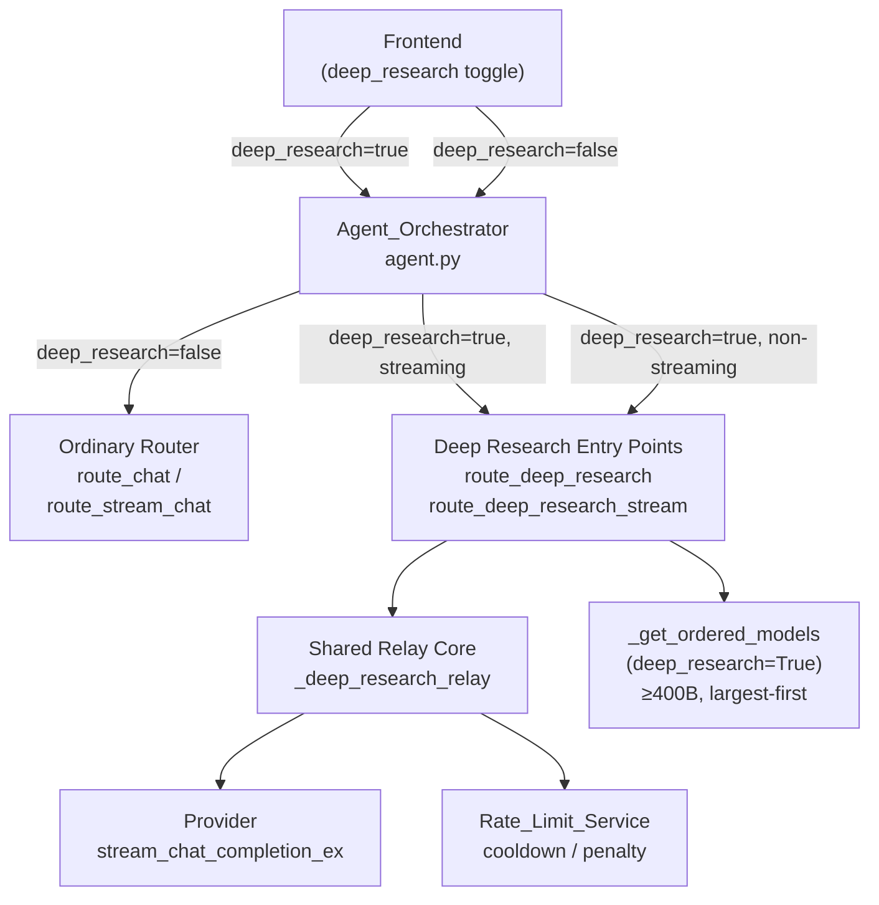
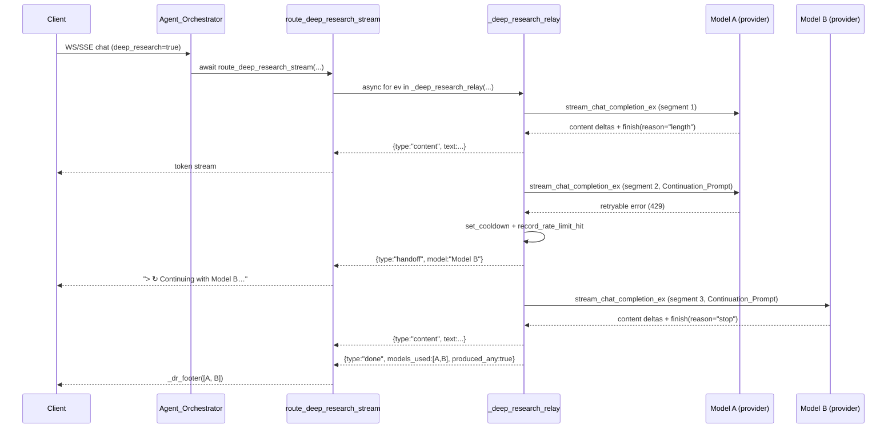

# Design Document: Intellectual Routing (Deep Research Continuation)

## Overview

Intellectual Routing is the Deep Research answer-continuation strategy built into the `Fallback_Router`. When a user enables the Deep Research toggle, the system treats the entire answer as a single continuous deliverable that may span one or more large (≥ 400B-parameter) models:

- **Same-model continuation**: if a model is cut off by its output-token limit (`finish_reason == "length"`), the same model is immediately asked to resume from exactly where it stopped — no user input required.
- **Cross-model hand-off**: if a model rate-limits, stalls, or errors, the next eligible large model receives all work produced so far and continues seamlessly.
- **Attribution footer**: every completed answer ends with a note naming every model that contributed, in the order they contributed.

The feature is entirely scoped to the Deep Research path. Ordinary (non-Deep-Research) chat routing is completely unchanged.

### What was NOT changed

The existing `route_chat` and `route_stream_chat` functions are untouched. Their call paths, retry logic, model selection, and error handling are identical to before this feature. Any request that arrives with `deep_research == false` follows exactly the same path as before.

## Architecture

The Intellectual Routing subsystem lives entirely inside two existing files:

- `app/services/fallback_router.py` — all routing logic, model gating, the shared relay core, and both entry points.
- `app/services/agent.py` — the `Agent_Orchestrator` that decides which router to dispatch to based on the `deep_research` flag.

Supporting infrastructure that is consumed but not modified:

- `app/services/rate_limit.py` — cooldown management and `is_retryable_error` classification.
- `app/providers/base.py` — `LlmProvider.stream_chat_completion_ex` base interface.
- `app/providers/openai_compat.py` — overrides `stream_chat_completion_ex` to surface real `finish_reason`.
- `app/providers/google.py` — inherits the base default (reports `finish_reason=None`).



### Request flow — streaming path



### Request flow — non-streaming path

The non-streaming path (`route_deep_research`) consumes the identical `_deep_research_relay` generator, buffers all content events, and returns a single assembled `RouteResult`. The relay logic — segment loop, continuation, hand-off, safety bounds — is byte-for-byte shared.

## Components and Interfaces

### 1. Deep-Research Model Gating (`fallback_router.py`)

**`_param_billions(model: ChatModel) -> float | None`**

Best-effort parameter count for a model. Prefers an explicit `<n>b` token in the model ID or display name (via `_PARAM_RE = re.compile(r"(\d+(?:\.\d+)?)\s*b\b")`), then falls back to `_KNOWN_PARAMS_B` for closed/oddly-named large models. Returns `None` when size cannot be determined.

```python
_KNOWN_PARAMS_B = {
    "deepseek-v3": 671, "deepseek-r1": 671, "deepseek-chat": 671,
    "deepseek-reasoner": 671, "deepseek-v3.1": 671, "deepseek-v3.2": 671,
    "kimi-k2": 1000,
    "llama-4-maverick": 400, "llama-4-behemoth": 2000,
}
```

**`_is_deep_research_model(model: ChatModel) -> bool`**

Returns `True` only if the model is chat-capable (`_is_chatty`) and `_param_billions` returns ≥ `_MIN_DEEP_RESEARCH_B` (400.0). This is the sole gate for all Deep Research model eligibility.

**`_get_ordered_models(db, requested_model, messages, deep_research=False) -> list[ChatModel]`**

When `deep_research=True`: ignores `requested_model` and the complexity-tier heuristic entirely. Returns only `_is_deep_research_model` models from platforms with active (enabled, non-error) keys, sorted by `(-param_billions, priority)` — largest model first. Returns an empty list if no eligible model exists.

**`DeepResearchUnavailableError(RuntimeError)`**

Raised by both entry points when `_get_ordered_models(deep_research=True)` returns an empty list. Carries a user-facing, actionable message naming the missing capability and a concrete provider/model to add.

### 2. Continuation and Attribution Helpers (`fallback_router.py`)

**`_dr_continue_messages(base_messages, accumulated) -> list[MessageDto]`**

Builds the Continuation_Prompt for any non-first segment:

1. Returns `list(base_messages)` unchanged if `accumulated` is empty (first segment).
2. Otherwise appends two messages to a copy of `base_messages`:
   - `MessageDto(role="assistant", content=ctx)` — where `ctx = accumulated[-_DR_CONTEXT_CHARS:]`
   - `MessageDto(role="user", content=<resume instruction>)` — instructs the model to continue from the exact stopping point without repeating anything already produced.

The tail-truncation ensures the context window budget is not exceeded for very long relays.

**`_dr_footer(models_used: list[str]) -> str`**

Generates the attribution footer:
- Empty list → `""` (guard; should not occur in normal flow).
- 1 model → `"\n\n---\n*🔬 Deep Research · generated by **{name}***"`
- ≥ 2 models → `"\n\n---\n*🔬 Deep Research · assembled across **{N} models**: {A → B → …}*"`

**`_DR_EMPTY_MSG`** — user-facing string emitted when the relay finishes having produced no content (all models rate-limited or failed without output).

### 3. Streaming Provider Interface (`providers/base.py`, `providers/openai_compat.py`)

**`LlmProvider.stream_chat_completion_ex(...) -> AsyncGenerator[dict, None]`**

Extended streaming method that yields two event types:

| Event type | Fields | Description |
|---|---|---|
| `content` | `text: str` | A token delta |
| `finish` | `reason: str \| None` | Why generation stopped |

The base class default wraps `stream_chat_completion` and always reports `reason=None`.

`OpenAICompatProvider` overrides this method to read the real `finish_reason` from each SSE chunk and surface it in the final `finish` event. This is what enables the relay to distinguish truncation (`"length"`) from natural completion (`"stop"`).

`GoogleProvider` does not override — the relay treats `reason=None` after text production as a natural stop (safe default).

### 4. Shared Relay Core — `_deep_research_relay` (`fallback_router.py`)

```python
async def _deep_research_relay(
    db: Session,
    models: list[ChatModel],
    messages: list[MessageDto],
    temperature: float | None,
    max_tokens: int | None,
) -> AsyncGenerator[dict, None]:
```

The central async generator shared by both entry points. All state is local — no module-level mutable variables are touched. Key state locals:

| Variable | Type | Purpose |
|---|---|---|
| `accumulated` | `str` | All text produced so far across every segment |
| `models_used` | `list[str]` | Ordered, deduplicated contributor display names |
| `skip_platforms` | `set[str]` | Platforms excluded due to auth failure |
| `skip_model_ids` | `set[int]` | Models excluded (failed or produced nothing) |
| `idx` | `int` | Current position in the models list |
| `iters` | `int` | Number of segments completed |
| `deadline` | `float` | `time.monotonic() + DEEP_RESEARCH_BUDGET_S` |

**Segment loop invariant**: one pass through the `while` loop = one segment call to one provider. The loop advances `idx` to the next model only on failure/exhaustion; on truncation (`finish_reason == "length"`) `idx` stays pointing at the same model so it is reused immediately.

**Per-token stall timeout**: every `await agen.__anext__()` is wrapped in `asyncio.wait_for(..., timeout=_DR_STALL_TIMEOUT_S)`. A `TimeoutError` is re-raised as a `RuntimeError` naming the model, which is then caught by the outer `except Exception` and treated as a hand-off trigger.

**models_used deduplication**: a model's display name is appended only when `produced.strip()` is truthy AND the last entry is not already that model. This naturally deduplicates consecutive same-model segments and ensures only actual contributors appear in the footer.

### 5. Entry Points (`fallback_router.py`)

**`route_deep_research_stream(db, messages, temperature, max_tokens) -> StreamRouteResult`**

Streaming entry point. Calls `_get_ordered_models(deep_research=True)`, raises `DeepResearchUnavailableError` if empty, then returns a `StreamRouteResult` whose `.stream` is an async generator that translates relay events:

| Relay event | Rendered output |
|---|---|
| `content` | `yield ev["text"]` |
| `handoff` | `yield f"\n\n> ↻ *Continuing with **{ev['model']}**…*\n\n"` |
| `done` (has models_used) | `yield _dr_footer(ev["models_used"])` |
| `done` (no content) | `yield _DR_EMPTY_MSG` |

The `display_name` on the returned `StreamRouteResult` is always `"Deep Research"` (not a specific model name), reflecting that the answer may span multiple models.

**`route_deep_research(db, messages, temperature, max_tokens) -> RouteResult`**

Non-streaming entry point. Consumes the same relay to completion, joining all `content` events into a single string, then appends the footer or empty message. Returns a `RouteResult` with `display_name="Deep Research"` and `attempts=len(models_used)`.

### 6. Agent_Orchestrator Dispatch (`agent.py`)

`agent_chat` and `agent_stream_chat` both read `deep_research = bool(getattr(request, "deep_research", False))`. The dispatch branch:

```python
if deep_research:
    result = await route_deep_research[_stream](db=db, messages=messages, ...)
else:
    result = await route_[stream_]chat(db=db, messages=messages, ...)
```

`DeepResearchUnavailableError` is caught explicitly and converted to a user-facing string. No stack trace is exposed. Generic `Exception` is caught with a generic apology message.

A Deep Research system-prompt addendum is injected into `messages` by `_build_agent_messages` when `deep_research=True`, instructing the model to be rigorous, structured, and source-citing.

## Data Models

### Relay Event Schema

The relay yields plain `dict` objects. There are exactly three event types:

```python
# Token delta
{"type": "content", "text": str}

# Model switch (only emitted when there was prior accumulated content
# and the new model is different from the last contributor)
{"type": "handoff", "model": str}  # model display name

# Terminal event — always the last event yielded
{"type": "done", "models_used": list[str], "produced_any": bool}
```

### RouteResult and StreamRouteResult

Both are standard `@dataclass` types already used by ordinary routing:

```python
@dataclass
class RouteResult:
    content: str        # full assembled answer including footer
    model_id: str       # first model's ID (or the pool leader)
    platform: str       # first model's platform
    display_name: str   # always "Deep Research" for DR results
    attempts: int       # number of contributing models

@dataclass
class StreamRouteResult:
    stream: AsyncGenerator[str, None]  # text-only chunks (rendered)
    model_id: str
    platform: str
    display_name: str   # always "Deep Research"
    attempts: int       # always 0 for DR (no per-attempt retry)
```

### Safety Bounds and Configuration

| Constant | Value | Requirement |
|---|---|---|
| `DEEP_RESEARCH_MAX_ITERS` | `12` | Max segments stitched into one answer |
| `DEEP_RESEARCH_BUDGET_S` | `240.0` s | Wall-clock cap for a full relay |
| `_DR_CONTEXT_CHARS` | `80 000` chars | Tail of prior work passed to next model |
| `_DR_STALL_TIMEOUT_S` | `30.0` s | Max wait for a single token before hand-off |
| `_MIN_DEEP_RESEARCH_B` | `400.0` B | Minimum parameter count for DR eligibility |

## Error Handling

### Retryable vs. non-retryable errors

`rate_limit.is_retryable_error(e)` classifies exceptions by message substring matching. The relay reacts as follows:

| Error type | Action |
|---|---|
| Retryable (429, quota, timeout, 500, connection) | `set_cooldown` + `record_rate_limit_hit` + `skip_model_ids.add(model.id)` + advance `idx` |
| Auth failure (401, 403, unauthorized, forbidden, invalid api key, authentication) | Same as retryable **plus** `skip_platforms.add(model.platform)` — entire platform skipped |
| Non-retryable | `skip_model_ids.add(model.id)` + advance `idx` |
| Stall (`asyncio.TimeoutError` from `wait_for`) | Raised as `RuntimeError`, caught by the outer except, treated as retryable hand-off |

Partial text produced before any failure is always retained in `accumulated` because `produced` (the segment's own output) is concatenated to `accumulated` before the error handler runs.

### DeepResearchUnavailableError

Raised when the model pool is empty at entry-point time (before the relay even starts). Both entry points check this immediately after `_get_ordered_models`. The `Agent_Orchestrator` catches it and surfaces `str(e)` verbatim to the user — the message names a specific provider and model to add.

### All-rate-limited relay

When the relay loop exits without any model having produced content (`produced_any == False`), the entry points emit `_DR_EMPTY_MSG` instead of the footer. This is a clean, user-visible non-technical message.

### Internal error isolation

The `Agent_Orchestrator` wraps the entire entry-point call in a `try/except DeepResearchUnavailableError` (clean user message) / `except Exception` (generic apology, never a stack trace). No internal error detail reaches the API response.

## Correctness Properties

*A property is a characteristic or behavior that should hold true across all valid executions of a system — essentially, a formal statement about what the system should do. Properties serve as the bridge between human-readable specifications and machine-verifiable correctness guarantees.*

### Property 1: Deep Research path selection

*For any* `Chat_Request`, the `Agent_Orchestrator` SHALL dispatch to `route_deep_research` / `route_deep_research_stream` if and only if `deep_research == true`, and to `route_chat` / `route_stream_chat` otherwise. For any request with `deep_research=True`, every model in the pool returned by `_get_ordered_models` shall pass `_is_deep_research_model`.

**Validates: Requirements 1.1, 1.2, 1.3**

---

### Property 2: Continuation prompt integrity

*For any* non-empty `base_messages` list and any accumulated string, `_dr_continue_messages(base_messages, accumulated)` SHALL:
- Append exactly two messages beyond `base_messages`: an `assistant` message and a `user` message.
- Set the `assistant` message content to `accumulated[-_DR_CONTEXT_CHARS:]` (or all of `accumulated` when it is shorter than `_DR_CONTEXT_CHARS`).
- Set the `user` message to the resume instruction.
- Never mutate `base_messages`.

**Validates: Requirements 2.2, 2.3**

---

### Property 3: Same-model continuation on truncation

*For any* relay where the current segment ends with `finish_reason == "length"` and no error occurs, the relay SHALL issue the next segment call to the **same** model (same `model.id`), not advance to a different model.

**Validates: Requirements 2.1, 4.1**

---

### Property 4: Retryable error triggers hand-off with partial text retained

*For any* relay where model A raises a retryable error after producing some partial text, the relay SHALL:
1. Record a cooldown for model A via `rate_limit.set_cooldown`.
2. Record a rate-limit hit for model A via `rate_limit.record_rate_limit_hit`.
3. Add model A to `skip_model_ids`.
4. Pass all partial text produced by A in `accumulated` to the next model's Continuation_Prompt.

**Validates: Requirements 3.1, 3.5**

---

### Property 5: Stall detection forces hand-off

*For any* relay where a model's async generator produces no token for `_DR_STALL_TIMEOUT_S` seconds, the relay SHALL detect the timeout and hand off to the next eligible model without waiting indefinitely.

**Validates: Requirements 3.2, 4.5**

---

### Property 6: Auth failure skips entire platform

*For any* relay where model A raises an error whose message contains an auth-failure marker (`401`, `403`, `unauthorized`, `forbidden`, `permission`, `invalid api key`, or `authentication`), the relay SHALL add model A's `platform` to `skip_platforms`, causing all subsequent models on that platform to be bypassed in the same relay.

**Validates: Requirements 3.3**

---

### Property 7: No intra-relay model retry

*For any* relay, a model that has been added to `skip_model_ids` (due to failure, auth error, or producing no text) SHALL NOT be selected for any subsequent segment within that same relay.

**Validates: Requirements 3.7**

---

### Property 8: Natural stop terminates relay

*For any* relay where the current segment ends with `finish_reason == "stop"` (or any non-`"length"` reason after producing text), the relay SHALL emit the `done` event immediately without starting another segment.

**Validates: Requirements 4.1**

---

### Property 9: Relay safety bounds — relay always terminates

*For any* relay, the relay SHALL emit the `done` event within the following bounds, whichever is reached first:
- After at most `DEEP_RESEARCH_MAX_ITERS` total segment calls.
- After at most `DEEP_RESEARCH_BUDGET_S` wall-clock seconds from relay start.
- When no eligible model remains in the pool.

**Validates: Requirements 4.2, 4.3, 4.4**

---

### Property 10: Attribution footer integrity

*For any* non-empty `models_used` list, `_dr_footer(models_used)` SHALL contain every display name in `models_used` in order. For a single-element list it SHALL name that model; for two or more it SHALL state the count and join names with ` → `. Models that produced no usable text (empty/whitespace) SHALL NOT appear in `models_used` and therefore SHALL NOT appear in the footer.

**Validates: Requirements 5.1, 5.2, 5.3, 5.4, 5.5**

---

### Property 11: Empty relay emits non-technical message

*For any* relay that terminates having produced no content (`produced_any == False`), the entry point SHALL yield `_DR_EMPTY_MSG` rather than an empty string or a raw exception.

**Validates: Requirements 6.2**

---

### Property 12: Streaming / non-streaming behavioral parity

*For any* relay configuration (any sequence of models and finish reasons), the sequence of text chunks emitted by `route_deep_research_stream` concatenated shall equal the `content` field returned by `route_deep_research` (excluding the streaming-only handoff markers which have no non-streaming equivalent), and both SHALL include the identical `_dr_footer`.

**Validates: Requirements 7.1, 7.3**

---

### Property 13: No cross-request state contamination

*For any* two concurrent invocations of `_deep_research_relay` with different `models` and `messages` parameters, the state accumulated by one relay (its `accumulated`, `models_used`, `skip_model_ids`, `skip_platforms`) SHALL NOT affect the state of the other relay.

**Validates: Requirements 7.4**

## Testing Strategy

This feature has two types of pending test work (tasks 8.2 and 8.3). Both should use Python's **Hypothesis** library, which is already present in the project (`.hypothesis/` directory exists), for property-based testing, and `pytest-asyncio` for async tests.

### Unit tests (`tests/unit/test_deep_research_relay.py`)

**Dual testing approach**: unit tests cover specific examples and boundary conditions; property tests verify universal invariants across generated inputs.

**Example-based unit tests** (one-shot, concrete scenarios):

1. Smoke scenario — A truncates → same-model continue → A rate-limits → hand-off to B → B finishes → footer credits `[A, B]` in order. Verifies the full relay lifecycle.
2. `DeepResearchUnavailableError` — both entry points raise it when `_get_ordered_models` returns `[]`.
3. `DeepResearchUnavailableError` surface — mock `route_deep_research` to raise it; assert `agent_chat` returns `str(e)` with no stack trace.
4. Auth failure skips platform — mock 401 from platform A; assert models on A are skipped, models on B continue.
5. Empty relay message — all models fail without producing content; assert output equals `_DR_EMPTY_MSG`.

**Property-based tests** (minimum 100 iterations each via `@settings(max_examples=100)`):

| Test | Property | Tag |
|---|---|---|
| `test_dr_continue_messages_integrity` | Property 2 — tail-truncation + structure | `Feature: intellectual-routing, Property 2` |
| `test_dr_footer_names_all_contributors` | Property 10 — footer contains all names in order | `Feature: intellectual-routing, Property 10` |
| `test_relay_same_model_on_length` | Property 3 — same model reused on truncation | `Feature: intellectual-routing, Property 3` |
| `test_relay_hand_off_retains_partial` | Property 4 — partial text in accumulated after error | `Feature: intellectual-routing, Property 4` |
| `test_relay_no_retry_failed_model` | Property 7 — skip_model_ids respected | `Feature: intellectual-routing, Property 7` |
| `test_relay_iter_cap` | Property 9 — never exceeds DEEP_RESEARCH_MAX_ITERS | `Feature: intellectual-routing, Property 9` |
| `test_relay_streaming_nonstreaming_parity` | Property 12 — content identical across entry points | `Feature: intellectual-routing, Property 12` |
| `test_relay_no_cross_request_state` | Property 13 — concurrent relays isolated | `Feature: intellectual-routing, Property 13` |

All property tests mock the SQLAlchemy session and provider calls so they run entirely in-memory without network or DB access.

### Integration tests (`tests/integration/test_deep_research_integration.py`)

Hit `/api/chat/send` and `/api/chat/stream` with `deep_research=true` against a stubbed provider that:
1. Returns `finish_reason="length"` on the first call (forcing continuation).
2. Returns `finish_reason="stop"` on the second call (natural finish).

Assertions:
- Response body contains `---` (footer separator).
- Response body contains the model name.
- No `"continue"` prompt appears in the conversation history.
- `deep_research=false` requests hit the ordinary path and produce no footer.

These are run as example-based tests (3–5 scenarios), not property tests, because they exercise infrastructure wiring rather than pure logic.
